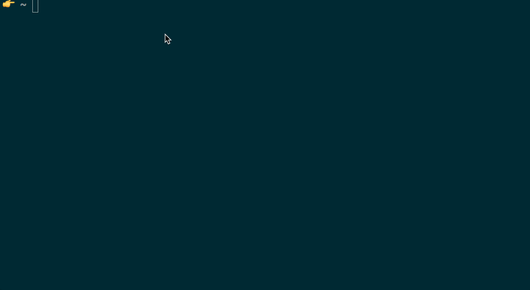

# [Create *K*ubernetes _app_ (`kapp`)](https://peterj.github.io/kapp/)

[](https://travis-ci.org/peterj/kapp)
[](https://github.com/peterj/kapp/releases)
[](https://codecov.io/gh/peterj/kapp)

Create Go apps/services that run on Kubernetes with minimal configuration.
Inspiration for this project came from
[create-react-app](https://github.com/facebook/create-react-app) project.

*   [Quick Overview](#quick-overview)
*   [Prerequisites](#prerequisites)
*   [Installation](#installation)
*   [Creating an App](#creating-an-app) - How to create a new Kubernetes app
*   [Development Workflow](#development-workflow)

Tool was developed and tested on macOS. There's no guarantee that it works on
other platforms. If you run into any issues, please
[file them](https://github.com/peterj/kapp/issues/new).

> **Note**: At the moment, project only supports Go. Please
> [file an issue](https://github.com/peterj/kapp/issues/new) if you'd like to
> see support for other languages and/or [send a PR](CONTRIBUTING).

# Quick Overview

```bash
# Creates an app called helloworld
kapp create helloworld --package github.com/peterj/helloworld

# Initialize the Git repo and make an inital commit
cd helloworld
git init && git add * && git commit -m 'inital commit'

# Build the app
make all
```

Run the app with `./helloworld` and access it at http://localhost:8080/.



# Prerequisites

*   [Go](https://golang.org/dl/)
*   [Docker](https://www.docker.com/docker-mac)
*   [Helm](https://helm.sh/)
*   [Dep](https://github.com/golang/dep)
*   [Git](https://git-scm.com/)
*   Kubernetes cluster - you can also use Kubernetes support in
    [Docker for Mac](https://www.docker.com/docker-mac),
    [Minikube](https://github.com/kubernetes/minikube) or an actual cluster from
    one of the cloud providers

# Installation

You can download the latest binary from the
[Releases page](https://github.com/peterj/kapp/releases). Alternatively, you can
use `go get` and install `kapp` like that:

```bash
go get github.com/peterj/kapp
make install
```

Alternatively, you can install kapp using `homebrew` on a mac.
``` bash
brew install peterj/kapp/kapp
```

# Creating an app

To create a new Kubernetes app, run the following command:

```
kapp create helloworld --package github.com/[username]/helloworld
```

_Note: the package name is required in order to properly configure the generated
files._

The command above will create a folder called `helloworld` in the current
working folder. The structure of the created Go project looks like this:

```
helloworld
├── .gitignore
├── Dockerfile
├── Makefile
├── VERSION.txt
├── docker.mk
├── helm
│   └── helloworld
│       ├── Chart.yaml
│       ├── templates
│       │   ├── _helpers.tpl
│       │   ├── deployment.yaml
│       │   └── service.yaml
│       └── values.yaml
├── main.go
└── version
    └── version.go
```

# Development workflow

The inital workflow for getting your app running in Kubernetes involves these
steps:

1.  [Build the app image](#build-the-image)
2.  [Push the app image to the registry](#push-the-image)
3.  [Create intial app release (first deployment)](#first-deployment)
4.  [Interact with the app](#interact-with-the-app)
5.  [Deploy app updates](#deploy-app-upgrades)

After you have created the inital release (step #3) you can continue with this
[workflow](#deploy-app-upgrades)

## Build the image

Makefile task `build.image` can be used to build the Docker image that contains
your app and tag that image. Note that before you run `make build.image`, you
have to do these two things:

1.  Login to the image registry you want to use
2.  Set the `DOCKER_REGISTRY` environment variable to that registry

Below is an example on how to set the image registry and run the `build.image`
task:

```bash
$ cd helloworld

# Login to the hub.docker.com (or any other image registry)
$ docker login

# Replace 'kubeapp' with your hub.docker.com username
$ export DOCKER_REGISTRY=kubeapp

# Build the image in format: kubeapp/helloworld:0.1.0
$ make build.image
-> build.image
docker build -f  Dockerfile -t  kubeapp/helloworld:0.1.0 .
... (Docker build output) ...
Successfully tagged kubeapp/helloworld:0.1.0
```

## Push the image

With image built, you can use `make push.image` task to push the built image to
the registry:

```bash
$ make push.image
-> push.image
docker push  kubeapp/helloworld:0.1.0
The push refers to repository [docker.io/kubeapp/helloworld]
... (docker push output)
0.1.0: digest: sha256:b13772ff86c9f2691bfd56a6cbdc73d3456886f8b85385a43699706f0471c866 size: 1156
```

## First deployment

Task `install.app` is used to create an inital installation/deployment of your
app to Kubernetes. Before running this task, you need to ensure you have Helm
installed and initialized on the cluster and your current cluster context is set
to the cluster you want to deploy the app to.

```bash
$ make install.app
-> install.app
helm install --name helloworld --namespace helloworld --set=image.repository=kubeapp/helloworld --set=image.tag=0.1.0 helm/helloworld
NAME:   helloworld
LAST DEPLOYED: Tue May  1 16:25:54 2018
NAMESPACE: helloworld
STATUS: DEPLOYED

RESOURCES:
==> v1/Service
NAME        TYPE       CLUSTER-IP      EXTERNAL-IP  PORT(S)  AGE
helloworld  ClusterIP  10.100.205.117  <none>       80/TCP   0s

==> v1beta1/Deployment
NAME        DESIRED  CURRENT  UP-TO-DATE  AVAILABLE  AGE
helloworld  1        1        1           0          0s

==> v1/Pod(related)
NAME                         READY  STATUS             RESTARTS  AGE
helloworld-65b5fdc94f-42664  0/1    ContainerCreating  0         0s
```

The `install.app` task will install your application in `helloworld` namespace.
The initial installation creates a Kubernetes deployment as well as a Kubernetes
service you can use to access the application.

To double check your app is deployed, run the following Helm command:

```bash
$ helm list
NAME      	REVISION	UPDATED                 	STATUS  	CHART           	NAMESPACE
helloworld	1       	Tue May  1 16:25:54 2018	DEPLOYED	helloworld-0.1.0	helloworld
```

Alternatively, you can use `kubectl` to check the created resources. With the
command in the example below, we are getting all services and deployments from
the `helloworld` namespace that have a label called `app` set to `helloworld`:

```bash
$ kubectl get svc,deploy -l app=helloworld -n helloworld
NAME             TYPE        CLUSTER-IP       EXTERNAL-IP   PORT(S)   AGE
svc/helloworld   ClusterIP   10.100.205.117   <none>        80/TCP    2m

NAME                DESIRED   CURRENT   UP-TO-DATE   AVAILABLE   AGE
deploy/helloworld   1         1         1            1           2m
```

## Interact with the app

Now that your app is deployed and running in Kubernetes, you can interact with
it. There are a couple of different ways you could interact with the app, the
simplest being Kubernetes proxy to create a connection to the cluster:

```bash
# Create a proxy to the cluster and run it in the background
$ kubectl proxy &

# Access the deployed service through the proxy
$ curl http://127.0.0.1:8001/api/v1/namespaces/helloworld/services/helloworld:http/proxy/
Hello
```

Another way to access the service is to run a container inside the cluster and
run `curl` from there.

```bash
# This will give you a terminal inside the container running on the cluster
$ kubectl run curl --image=radial/busyboxplus:curl -i --tty

# Access the service 'helloworld' in namespace 'helloworld'
$ curl helloworld.helloworld.svc.cluster.local
Hello
```

## Deploy app upgrades

As part of your dev workflow, you will be making changes to your app and you
would want to deploy those changes and test the app out. Let's say we updated
the code in `main.go` to return `Hello World` instead of just `Hello`. After
you've built your app (e.g. `make all`), the sequence of commands to deploy the
updated app would be something like this:

```bash
# (OPTIONAL) Bumps the version in VERSION.txt file
$ make bump-version

# Builds the new version of the image, pushes it to the registry and upgrades the app
$ make upgrade
```

Now if you try to access the app you should get back `Hello World`.

# Contributing

See [CONTRIBUTING.md](CONTRIBUTING.md) for more information on how to get
started contributing to `kapp`.

# License

`kapp` is open source software [licensed as MIT](LICENSE).
